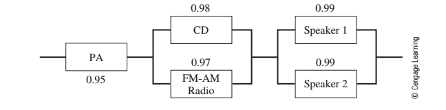

```{r setup, include=FALSE}
knitr::opts_chunk$set(echo = TRUE)
```

```{r}
library("ggplot2")
```

# P228 # 1 

Consider a model for the long-term dining behavior of the students at College USA. It is found that 25% of the students who eat at the college's Grease Dining Hall return to eat there again, whereas those who eat at Sweet Dining Hall have a 93% return rate. These are the only two dining halls available on campus, and assume that all students eat at one of these halls. Formulate a model to solve for the long-term percentage of students eating at each hall.


|       | Grease | Sweet |
|------:|-------:|------:|
|Grease | 0.25   | 0.75  |
|Sweet  | 0.07   | 0.93  |

   
$S_n =$ Percent of diners at Sweet Dining Hall for a meal period

$G_n =$ Percent of diners at Greese Dining Hall for a meal period

$G_{n+1} = .25 G_n + .07 S_n$

$S_{n+1} = .75 G_n + .93 G_n$


```{r}


grease_n <- function ( g, s) {
   .25*g + .07 * s 
}


sweet_n <- function ( g, s) {
   .75*g + .93 * s 
}

g<- 1
s<-0 
n<-0
 
dining <- data.frame(
  n = n,
  g = g,
  s = s ) 
  
  
 
  
for (n in 1:20 ) {
  g <- grease_n( g,s )
  s <- sweet_n( g,s )
  n <- n 
    
dining <- rbind ( dining , data.frame(
                                    n = n,
                                    g = g,
                                    s = s )
                       )
    
}
  
ggplot(dining, aes(n)) + 
  geom_point(aes(y = g, colour = "Grease DH")) + 
  geom_point(aes(y = s, colour = "Sweet DH"))  +
  theme(axis.title.y=element_blank())  + 
  ylab("Day") + 
  xlab ("Percent")
  


```
```{r}

dining
```


# P 232 #1

Consider a stereo with CD player, FM/AM radio tuner, speakers (dual), and power ampli er (PA) components, as displayed with the reliabilities shown in Figure 6.11. Determine the system's reliability. What assumptions are required in your model?





Assumptions:

  1) Faluire of Each Component is Independant
  2) We Have 3 SubSystems:
  + PA
  + Speakers
  + System Components (CD/Radio)
  
  
$R_{total} = R_{pa} * R_{speakers}*R_{comp}$

$R_{pa} = .95$

$R_{speakers} = (.99 + .99) - (.99)(.99)$

$R_{comp} = (.98 + .97) - (.98)(.97)$

$R_{total} = (.95)((.99 + .99) - (.99)(.99))   ( (.98 + .97) - (.98)(.97))$

$R_{total} =  .95 * .9999 *   .9994$

$R_{total} = .949$


# p 240 # 1 

For Table 2.7, predict weight as a function of height.


```{r}

hw_df <- data.frame (
  h =  c( 60, 61,62,63,64,65,66,67,68,69,70,71,72,73,74,75,76,77,78,79,80),
  w =  c(132,136,141,145,150,155,160,165,170,175,180,185,190,195,201,206,212,218,223,229,234)
  
)

n <- NROW(hw_df)

m <- ( (n * sum(hw_df [,"h"]* hw_df [,"w"]  )  ) -(sum(hw_df [,"h"]) ) * sum(hw_df [,"w"]) ) / ( n* sum(hw_df [,"h"]^2) -  (sum(hw_df [,"h"])) ^2   )   
 
b <- (sum(hw_df [,"w"]) - (m * sum(hw_df [,"h"]) ))/n

#sse

 

sse  <-  sum((hw_df$w - (m * hw_df$h + b))^2)
sst <- sum((hw_df$w  - mean(hw_df$w ))^2)

ssr <- sst-sse
r_sq <- 1-(sse/sst)
```

Equation: weight = `r round(m,2) ` height + ( `r round(b,2)`)

SSE: `r round(sse,2)  `

SSR: `r round(sse,2) `

$R^2$: `r round( r_sq,4)  ` 

  
