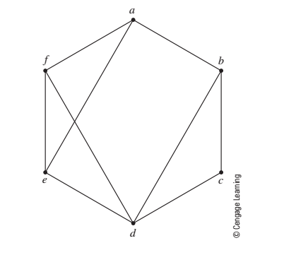

```{r setup, include=FALSE}
knitr::opts_chunk$set(echo = TRUE)
library(igraph)
```


#p 307 #1 

Consider the graph in Figure 8.11



a) Write down the set of edges:
E(g)= {ab; ae; af; bc; bd; cd; de; df; ef}


b) wich edges are incident with vertex b

ab,bc,bd

c) Which verticies are adjacent to vertex c
{a,h}

d) compute deg(a)
3

e) compute |E(G)| ={ab; ae; af; bc; bd; cd; de; df; ef }  =9


#p320 #10

Positions players can play:

Alice|Bonie|Courtney|Deb|Ellen|Fay|Gladys|Hermione
-----|-----|--------|------|-----|---|------|---------
1,2  | 1   | 1,2    |3,4,5 | 2   | 1 |3,4   |2,3


What changes if the coad decides she can't play Hermione in position?

There is a whole in the graph. Only Deb can play position 5.  Gladys can play position 3 or 4 but with out hermione there is a whole at position 3.   

#p330 #1

Find a shortest path from node a to node j in the graph in Figure 8.33 with edge weights shown on the graph.


<br>
<br>
<br>


```{r}

#note:  code copied from code professor posted on blackboard
df3 <- rbind(
c("a","b",2),
c("b","d",2),
c("d","g",2),
c("c","e",4),
c("e","h",2),
c("h","j",4),
c("f","i",6),
c("a","c",4),
c("b","e",7),
c("g","e",1),
c("g","j",8),
c("c","f",2),
c("e","i",2),
c("j","i",2)

)


df3 <- as.data.frame(df3)
names(df3) <- c("start_id","end_id","newcost")


g2 <- graph.data.frame(df3, directed=FALSE)


# compute the min distances from 'a' to all other vertices
tmp3 <- shortest.paths(g2,v='a',weights=E(g2)$newcost)

# print min distance from 'a' to 'j'
sp_lenght <- tmp3[1, which(V(g2)$name == 'j')]


```

```{r}
#Copied from https://stackoverflow.com/questions/19827139/highlight-shortest-path-on-plot-of-graph

ShortPth <- get.shortest.paths(g2, "a", "j")    # List of path 8->2

E(g2)$color <- "SkyBlue2"
E(g2)$width <- 1
E(g2, path=ShortPth$vpath[[1]])$color <- "red"
E(g2, path=unlist(ShortPth$vpath))$color <- "red"
E(g2, path=unlist(ShortPth[[1]]))$color <- "red"
plot(g2)


```

Shortest Path from a --> j is `{r}  sp_lenght `

