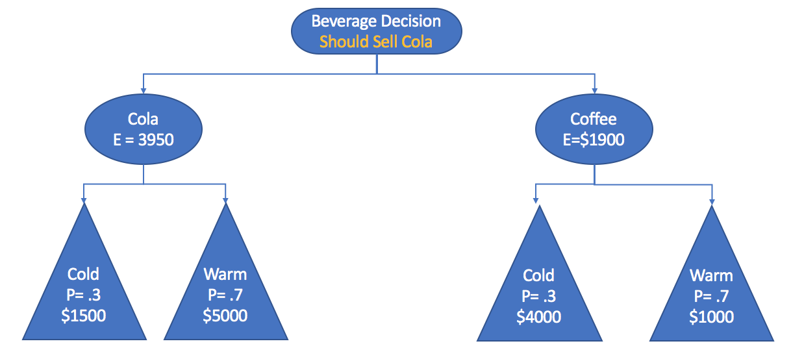
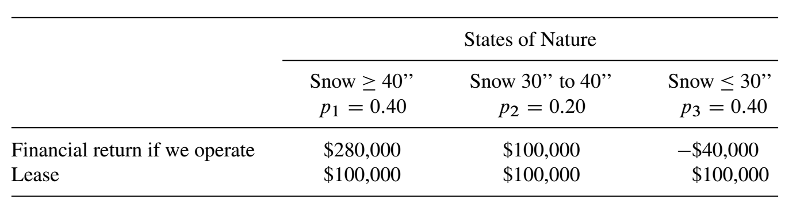
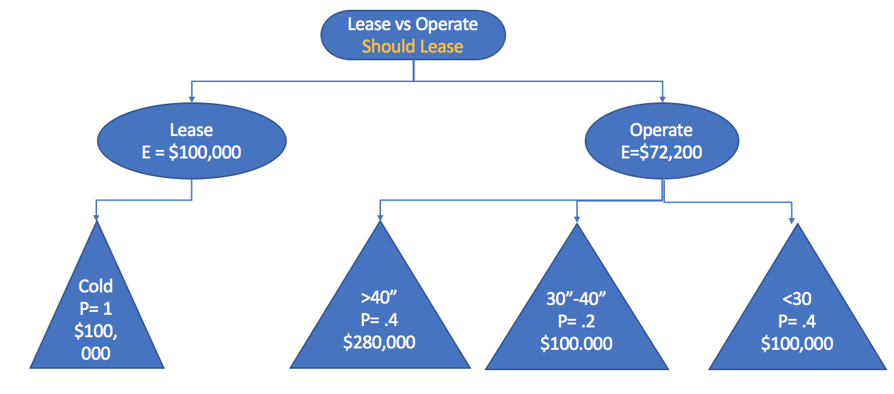

```{r setup, include=FALSE}
knitr::opts_chunk$set(echo = TRUE)
options(scipen=999)
```

#p347 #4


We have engaged in a business venture. Assume the probability of success is $P(s) \frac{2}{5}$; further assume that if we are successful we make \$ 55,000, and if we are unsuccessful we lose \$ 1750. Find the expected value of the business venture.

$E(venture) = \frac{2}{5} * \$55,000 + \frac{3}{5} *(\$-1,750)$

$E(venture) =  \$`r ((2/5) * 55000) - ((3/5)*1750)`$

#p346 #5
Consider a firm handling concessions for a sporting event. The firm's manager needs to know whether to stock up with coffee or cola and is formulating policies for specfic weather predictions. A local agreement restricts the firm to selling only one type of beverage. The firm estimates a \$1500 profit selling cola if the weather is cold and a \$5000 profit selling cola if the weather is warm. The rm also estimates a \$4000 profit selling coffee if it is cold and a \$1000 profit selling coffee if the weather is warm. The weather forecast says that there is a 30% of a cold front; otherwise, the weather will be warm. Build a decision tree to assist with the decision. What should the firm handling concessions do?


**Decision is Should Sell Cola**


#p355 #3 


The financial success of a ski resort in Squaw Valley is dependent on the amount of early snowfall in the fall and winter months. If the snowfall is greater than 40 inches, the resort always has a successful ski season. If the snow is between 30 and 40 inches, the resort has a moderate season, and if the snowfall is less than 30 inches, the season is poor, and the resort will lose money. The seasonal snow probabilities from the weather service are displayed in the following table with the expected revenue for the previous 10 seasons. A hotel chain has offered to lease the resort during the winter for \$100,000. You must decide whether to operate yourself or lease the resort. Build a decision tree to assist in the decision.





**Decision is Should Lease**