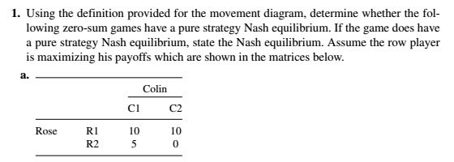
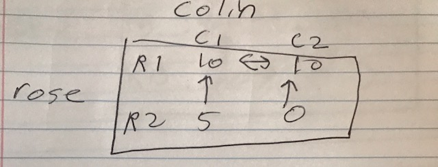
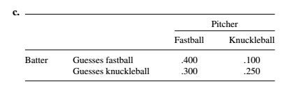
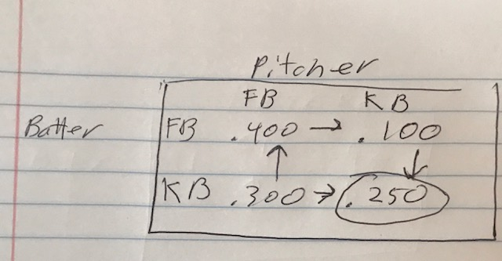
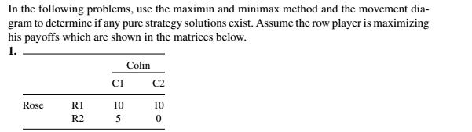
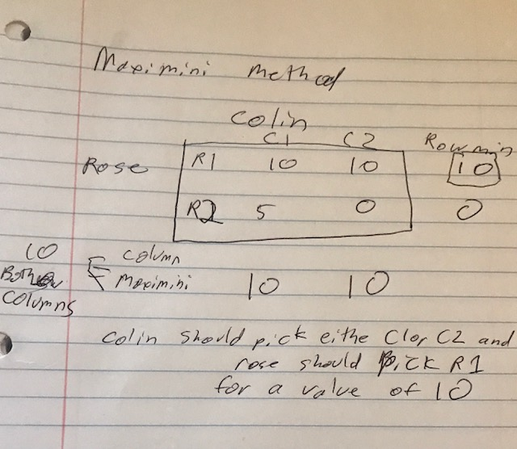
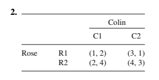
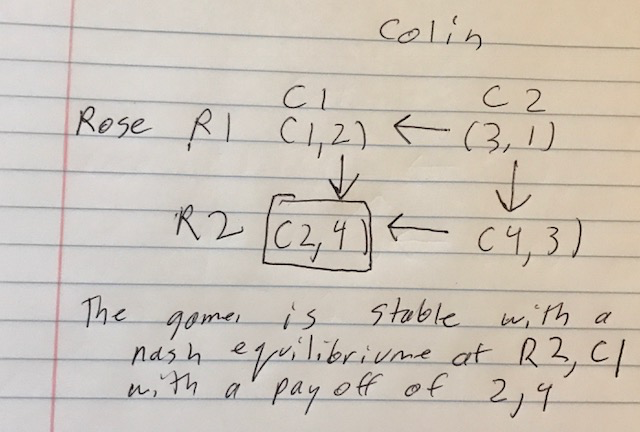

```{r setup, include=FALSE}
knitr::opts_chunk$set(echo = TRUE)
```

#p 385 #1a




Both players do not have a pure strategy.   Rose will always pick row R1, but colin will pick either C1 or C2.  

<hr>
#p 385 #2c





There is a pure Nash equilibrium here.  

The pitcher should throw a Knucklebal and the batter should guess aknNuckleball. 

Then the batting average will be .250
<hr>

#p420 #1






<hr>

#p440 #2
Use movement diagrams to find all the stable outcomes in Problems 1 through 5. Then use strategic moves (using Table 10.2 ) to determine if Rose can get a better outcome.








